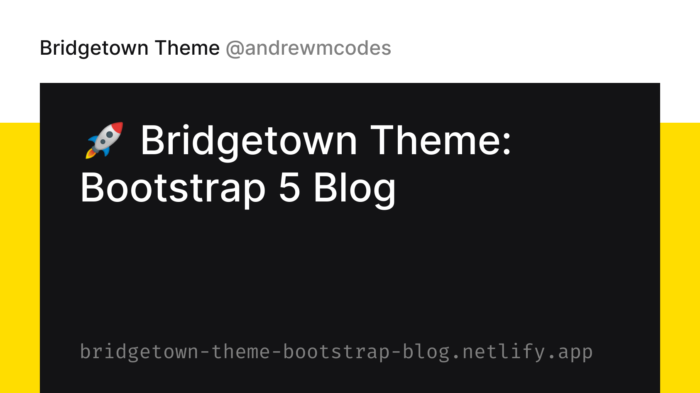

<p align="center">
  <a href="https://github.com/bt-rb" target="_blank" rel="noopener noreferrer">
    
  </a>
</p>

<h2 align="center">Bridgetown + Bootstrap 5 Theme</h2>

[](https://github.com/bt-rb/bridgetown-theme-bootstrap-blog)
[](https://github.com/bt-rb/bridgetown-theme-bootstrap-blog)
[](https://github.com/bt-rb/bridgetown-theme-bootstrap-blog)
[](https://app.netlify.com/sites/bridgetown-theme-bootstrap-blog/deploys)

- [Features](#features)
- [Ship It!](#ship-it)
- [System requirements](#system-requirements)
- [Installation](#installation)
- [Getting started](#getting-started)
- [Usage](#usage)
- [Issues](#issues)
- [Changelog](#changelog)
- [Contribution](#contribution)
- [License](#license)

## Features
- Bootstrap 5
- Optimized for production
- Inline SVG
- SEO
- Syntax highlighting via Dracula

## Ship It!

[](https://app.netlify.com/start/deploy?repository=https://github.com/bt-rb/bridgetown-theme-bootstrap-blog)

[](https://vercel.com/new/git/external?repository-url=https%3A%2F%2Fgithub.com%2Fbt-rb%2Fbridgetown-theme-bootstrap-blog&env=NODE_ENV&project-name=bridgetown-bootstrap-blog&repo-name=bridgetown-bootstrap-blog&demo-title=Bridgetown%20%2B%20Bootstrap%205%20Blog&demo-description=A%20Bridgetown%20%2B%20Bootstrap%205%20Blog%20Theme)

[](https://cloud.digitalocean.com/apps/new?repo=https://github.com/bt-rb/bridgetown-theme-bootstrap-blog/tree/main)

>Note: I have not verified the DO deploy process yet.

## System requirements
- Ruby >= `2.5`
- Node >= `10.13`
- Bundler
- Yarn

## Installation
Execute following commands to install:

```shell
bundle install && yarn install
```

## Getting started

Start developing by running the following command:

```shell
yarn start
```

Your site should now be live at [localhost:4000](http://localhost:4000).

## Usage

Develop your site, commit & push to GitHub, and deploy with your service of preference.

## Issues

Please make sure to read the [Issue Reporting Checklist](.github/CONTRIBUTING.md) before opening an issue. Issues not conforming to the guidelines may be closed immediately.

## Changelog

>TODO

## Contribution

Please make sure to read the [Contributing Guide](.github/CONTRIBUTING.md) before making a pull request.

## License

[MIT](https://opensource.org/licenses/MIT)

Copyright (c) 2020-present, Name
